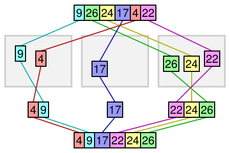

# Actividad Integral 6 - A01706212

## Bucket Sort

### ¿En qué consiste?

El Bucket Sort, también conocido como Bin Sort o ordenamiento por casilleros es un algorítmo de ordenamiento que distribuye todos sus elementos entre un número de casilleros
(buckets), para poder hacer esto tiene condicionales para evitar meter un dato en dos casilleros, los casilleros después se ordenan individualmente, este algoritmo es útil cuando 
se está trabajando con una cantidad uniforme de números, recibe como parametro un arreglo y el tamaño del arreglo, despues de que se ordenan los baldes, estos se unen a un sólo 
arreglo, arrojando así el resultado de los datos ordenados.

## ¿Para qué se usa?

Se utiliza como algoritmo de ordenamiento, así que en casi cualquier situación donde se tengan que ordenar datos de manera rápida, pues el ordenamiento por baldes es mucho más 
rápido que otros algoritmos de ordenamiento, aunque este asume que los datos son uniformes, en este caso como ejemplo se tiene un programa que recibe 5 datos de miligrajes de 
medicina y se desea ponerlos en orden pero de igual manera el algoritmo puede ser utilizado para ordenar las diferencias entre medidas de temperatura, los errores de márgen en 
medición de piezas, las edades de diferentes personas, etc.

## ¿Qué se hizo?

Se hizo un programa de ordenamiento de miligrajes, por lo que en especifico este bucket sort estará trabajando con floats, se recibe un archivo con los miligrajes en desorden 
llamado «btest.txt» conteniendo 5 miligrajes en formato «0.000, 0.000, 0.000, 0.000, 0.000», al ser leído el archivo estos se pasan a un vector temporal que nos permite 
utilizarlos en cualquier parte del programa, los datos se pasan de nuevo a un arreglo para hacer el ordenamiento y se despliegan ya ordenados los datos, una vez se hace esto se 
puede generar un archivo con los datos ordenados llamado «BUCKET.txt».

### Análisis de complejidad temporal

_Las complejidades de las funciones pasadas se encuentran en su respectiva entrega_

## main.cpp
El main comienza desplegando un menú switch con 5 cases, los cuales son utilizados para poder leer el archivo, ordenar los datos, generar el archivo ordenado, y los casos de 
prueba (opción 5 es salir), en este caso realmente sólo se utilizó la función _bucketSort()_ para ordenar los datos, para poder hacer uso de la función los datos debieron 
primero ser almacenados en un vector temporal llenado con los datos haciendo uso de la función _stof_ para poder urilizarlos fuera de su case de lectura del archivo, después 
sólo se tuvo que pasar el vector a un arreglo y obtener su tamaño, para poder pasar los datos a un archivo el arreglo ordenado se pasó a otro vector temporal y éste es el que 
vemos al generar nuestro archivo ordenado.
Con todo esto podemos decir que la complejidad temporal del main es O(1), es decir, lineal para el peor de los casos, pues solamente recibe entradas para hacer funciones de 
manera lineal.

### bucketsort.h

## bucketSort
El algoritmo busca ordenar los datos dividiendolos en varios «baldes» y luego juntando esos datos ordenados recorriendo n pasos haciendo uso de varios ciclos _for_, por lo que su complejidad temporal usualmente es de O(n+k), pues va a depender mucho de la cantidad de baldes que se estén creando para el ordenamiento de datos, este algoritmo puede ser extremadamente rápido o puede comenzar a utilizar demasiada memoria auxiliar, todo depende de los baldes, dicho esto la complejidad temporal para el peor de los casos es de O(n^2).
