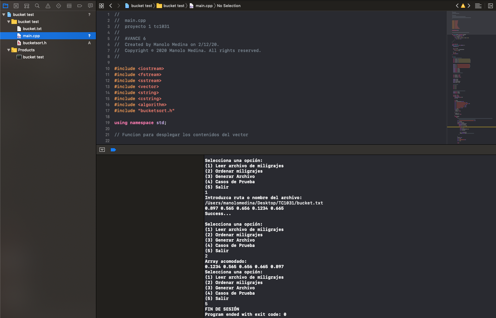

# Actividades Integrales

***SI LOS ARCHIVOS NO SE LEEN FAVOR DE ESCRIBIR LA RUTA COMPLETA, PARECE SER UN BUG CON REPLIT***

## CORRECCIONES:
- Actividad 1: Adicion de casos de prueba
- Actividad 2: Adicion de casos de prueba
- Actividad 3: Adicion de casos de prueba
- Actividad 4: Adicion de casos de prueba y mejoras de uso al igual que mejoras en el readme

- Actividad 6: El programa funciona, sin embargo existe un glitch por haber sido compilado en Repl.it, *favor de escribir la ruta del archivo que se desea leer para poder utilizarlo correctamente*

Se anexan pruebas de que el problema está en la localización del archivo al ejecutarlo con g++:

En xcode funciona al utilizar ruta de archivo completa:

