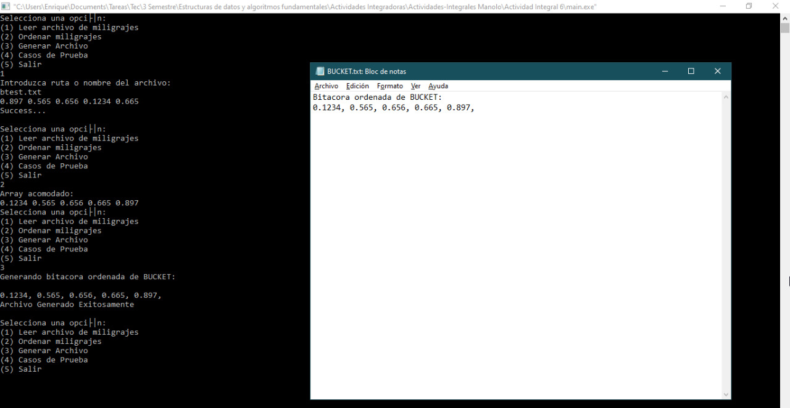
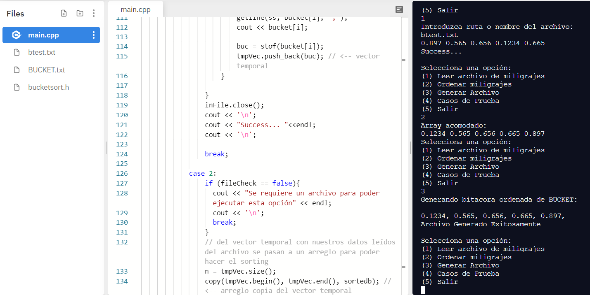

# Actividades Integrales

***SI LOS ARCHIVOS NO SE LEEN FAVOR DE ESCRIBIR LA RUTA COMPLETA, PARECE SER UN BUG CON LA TERMINAL DE UBUNTU***
***FAVOR DE EJECTUAR LOS PROGRAMAS EN REPLIT PARA EVITAR PROBLEMAS DE COMPATIBILIDAD***

## CORRECCIONES:
- Actividad 1: Adicion de casos de prueba
- Actividad 2: Adicion de casos de prueba
- Actividad 3: Adicion de casos de prueba
- Actividad 4: Adicion de casos de prueba y mejoras de uso al igual que mejoras en el readme

- Actividad 6: El programa funciona, sin embargo existe un glitch por haber sido compilado en Repl.it, *favor de escribir la ruta del archivo que se desea leer para poder utilizarlo correctamente*

Se anexan pruebas de que el problema está en la localización del archivo al ejecutarlo con g++, así que es probable que ocurra por algun problema de la terminal, al ser un error 
de Core Dumped es posible que no se tenga acceso a la memoria, o algo por el estilo, sin embargo el programa corre en distintos compiladores incluyendo los siguientes:

Se toma como consideración el correrlo en ReplIT para poder observar el programa en completo funcionamiento, en caso de que el error persista aún así se cuenta con los casos de 
prueba:

_En xcode funciona al utilizar ruta de archivo completa:_

_En CodeBlocks funciona sin ningun problema sin necesidad de la ruta, suponiendo que está en la misma carpeta:_

_En ReplIT funciona igualmente sin ningun problema:_

